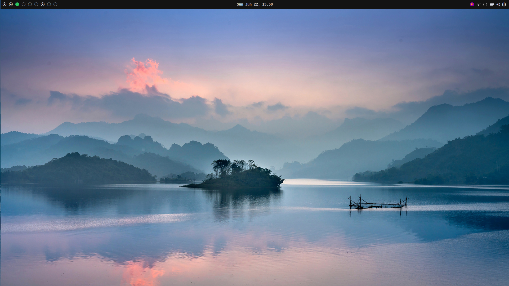
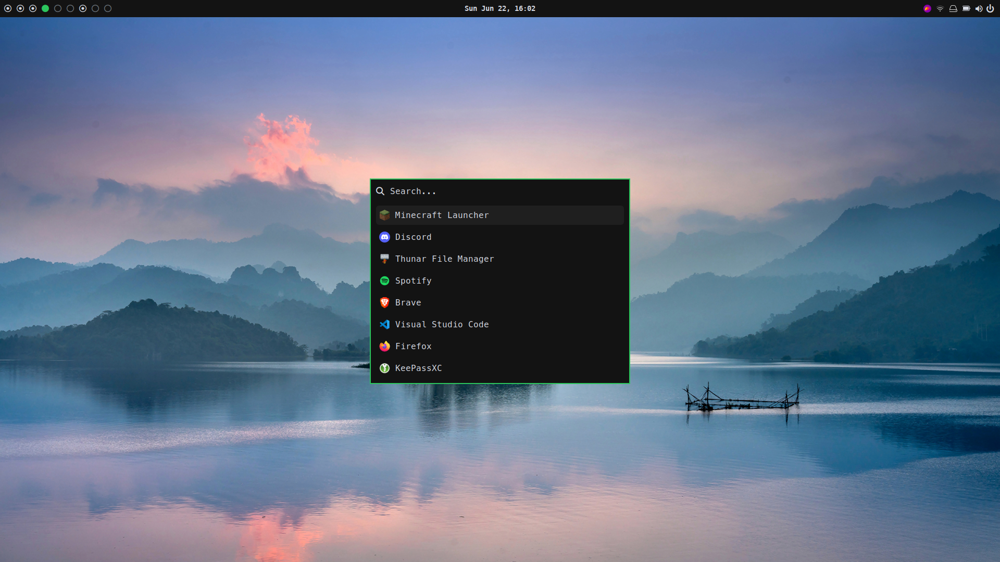
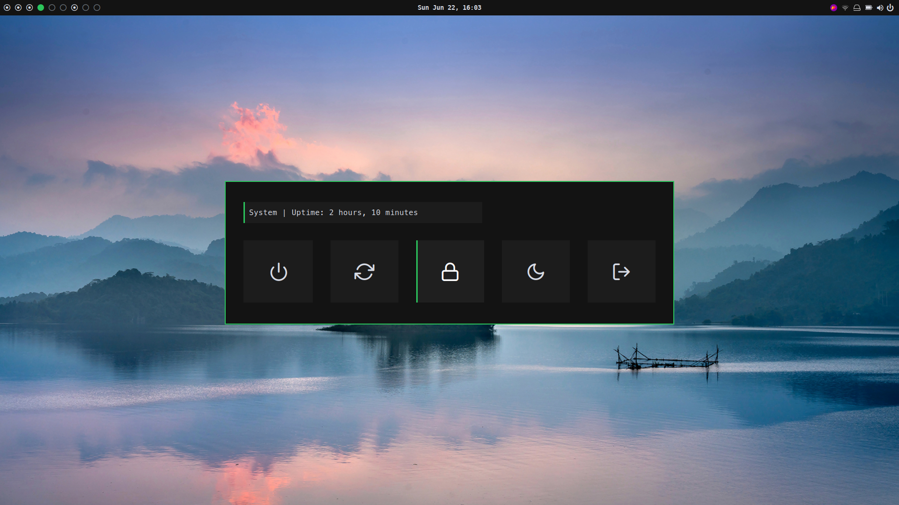
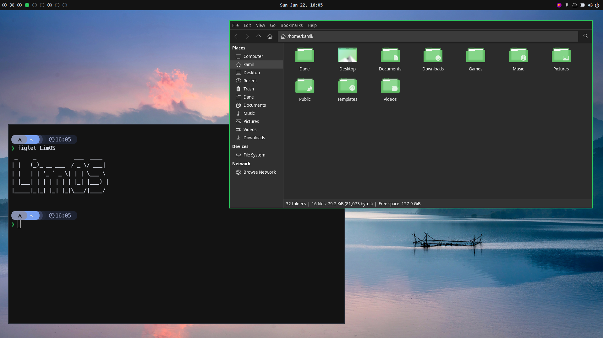

# 🚀 LimOS – Arch Linux post installation script


---

## 🧠 What is LimOS?

**LimOS** is my personal installation script for Arch Linux that will install and configure xmonad window manager along with all applications, dotfiles (in config folder) and utilities that are needed to create fully functional desktop environment.

---

## 🧰 Main functions

- ✅ Automatic installation of xmonad, polybar and all needed software
- ✅ Chaotic AUR repository
- ✅ **dotfiles** implementation with symbolic links
- ✅ GTK and QT theme
- ✅ Custom .bashrc with aliases and utility functions
  
---

## ⚙️ Installation

```bash
git clone https://github.com/Limak15/limos.git
cd limos
./limOS
```

---

## 🖼️ Desktop screenshots

<table>
<tr>
    <td>
        
    </td>
    <td>
        
    </td>
</tr>
<tr>
    <td>
        
    </td>
    <td>
        
    </td>
</tr>

</table>

---

## 📁 Project structure

```bash
limos/
├── limOS               # Main installation script
├── src/                # Rest of the installation scripts
├── scripts/            # Desktop environment scripts (changing volume level etc.)
├── config/             # Configuration files for bash, xmonad etc.
├── fonts/              # Fonts folder
├── themes/             # GTK and QT themes folder
└── screenshots/        # Screenshots for README
```
